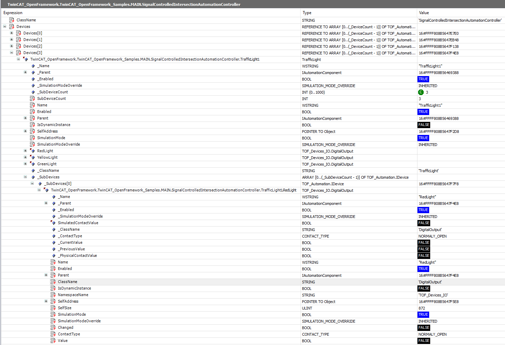

# AutomationEngine Concept

## 1. General Description

This is a deterministic PLC architectural platform designed to build modular control systems ranging from standalone machines to complex production lines. It provides built-in error handling, logging, multi-level simulation, and selective node disabling within nested component hierarchies.

---

## 2. Architecture: `AutomationRunner -> AutomationController -> Device`

At its core, this concept enforces a strict separation between **infrastructure code** (how hardware works) and **technological logic** (what the machine should do) through a rigid hierarchy of static objects.

## 3. Control Triad

The system is built on the interaction of three independent entities:

### 3.1. AutomationRunner

The lifecycle orchestrator — the **heart of the system**.

* Initializes all controllers
* Ensures their cyclic execution

Supported states are: `INITIALIZING`, `RUNNING`, `INITIALIZATION_FAILED`

### 3.2. AutomationController

The **logic conductor**.

* Owns a set of devices
* Manipulates them to perform a specific technological task
* Does **not** interact with I/O directly
* Operates through high-level device methods

Supported states are: `INITIAL`, `WORKING`, `FAULT`, `RESETTING`

### 3.3. Device

The **atomic unit** (or node) of the system.

* Encapsulates interaction with physical devices, communication channels, etc.
* Handles local state and error processing
* Has no knowledge of the overall process
* Exposes only a control interface

Supported device types: `Input`, `Output`, `InputOutput`, `Composite`

---

## 4. Recursive Device Composition (Composite Pattern)

Instead of a flat structure (`Module -> Component`), the system uses **unlimited nesting**:

* A device can be **simple** (sensor, motor) or **composite**

* A composite device consists of other devices:

  * input
  * output
  * or other composite devices

* The hierarchy is built using:

  * `Parent` reference
  * `SubDevices` collection

---

## 5. Static Polymorphism via `VAR_GENERIC CONSTANT`

To preserve PLC determinism and ensure efficient memory usage, child collections in composite devices are implemented using `VAR_GENERIC CONSTANT`.

### Benefits

**Safety**

* The number and types of subdevices are fixed at compile time

**Optimization**

* Memory is allocated exactly for the defined number of devices

**Strict static model**

* No dynamic allocation at runtime
* The object tree is created once during startup

---

## 6. Dependency Injection

Dependencies between nodes are established via the `FB_Init` method.

* Each device receives a reference to its `Parent` during initialization
* Guarantees a valid and complete object tree **before the first execution cycle**

### 7. Advantages

* Accelerates time-to-market
* Improves testability
* Enables modular design

---

## 8. Why is it effective?

### 8.1 Scalability

You can:

* Build a complex unit (e.g., a dosing station)
* Test it as a single `Device`
* Integrate it into a larger system as a single hierarchy element

> Nesting depth is unlimited.

---

### 8.2 Clean Logic Separation

* Controllers (**business logic**) are isolated from hardware drivers
* Changing a motor or sensor type does **not** require rewriting controller logic
* As long as the device interface remains unchanged

---

### 8.3. Reusability

* A device library (valves, drives, sensors) can be reused across projects
* Devices are:

  * framework-agnostic
  * self-contained

---

## 9. Developer Summary

This architecture mirrors the **physical structure of a machine** in code.

Example:

* A conveyor with three sections:

  * One `AutomationController`
  * Controls one `CompositeDevice` (Conveyor)

    * Contains three `CompositeDevices` (Sections)

      * Each contains its own `Devices` (Motors and Sensors)
	  
---

## 10. Result

---

## 11. Example

TwinCAT_OpenFramework_Samples -> SignalControlledIntersection
