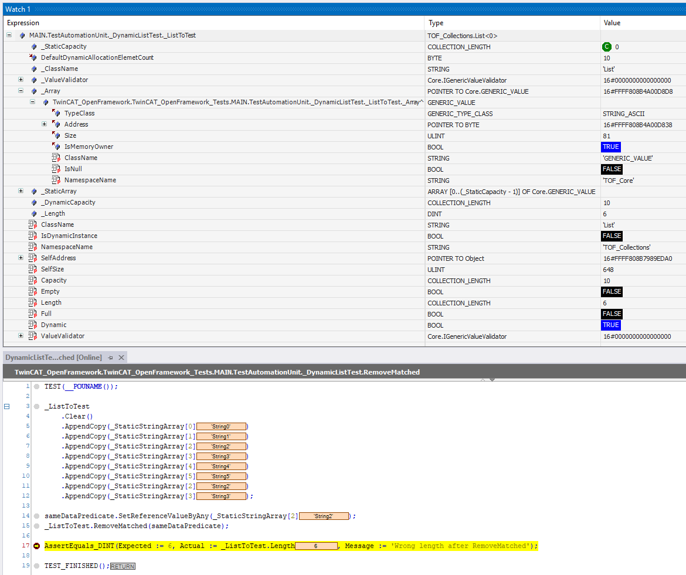

# Collections Concept

## Overview

Collections are abstract data types that allow you to store, organize, and manipulate a group of objects as a single entity.

## Built-in Language Options

The StructuredText language provides two basic ways to work with collections:
1. Arrays  
2. Pointers  

Both approaches have significant limitations. The `TwinCAT_OpenFramework_Collections` module is designed to overcome these limitations and provide a safer and more convenient way to work with collections.

## Limitations of Arrays and Pointers

1. Arrays have a fixed size and are not suitable when the amount of data is unknown in advance.  
2. Pointers allow working with both static and dynamic data, but type safety and memory management are entirely the developer’s responsibility.  
3. Pointer misuse can easily lead to controller crashes or system instability.  
4. Manual memory management often leads to memory leaks, which can eventually stop the controller.  
5. Implementing collection classes manually is complex and time-consuming.  
6. There is no support for generics, so typed collections require duplicating the same logic for each data type.  

## Standard Library Solutions

Some standard libraries provide basic collection-like structures, such as:
- `Tc2_Utilities.FB_MemRingBuffer`  
- `Tc2_Utilities.FB_HashTableCtrl`  

However, these solutions rely on external pointers, are outdated, harder to use, and less safe.

## What `TwinCAT_OpenFramework_Collections` Provides

The framework offers ready-to-use implementations of common collection types: ByteList, List, Dictionary, UniqueSet, Queue.

All collections are universal and store values using the `GENERIC_VALUE` type (except ByteList). 

`GENERIC_VALUE` concept described [here.](../Generics/GenericsConcept.md)

## Static and Dynamic Collections

Collections can be either static or dynamic:

- A collection is **static** if the `VAR_GENERIC CONSTANT` parameter is greater than zero.  
- A collection is **dynamic** if the `VAR_GENERIC CONSTANT` parameter is set to zero.  

The maximum number of elements a collection can hold is available via the `Capacity` property.  
The actual number of stored elements is available via the `Length` property.

- For static collections, `Capacity` is defined at declaration time.  
- For dynamic collections, `Capacity` grows as needed.  

## Key Features

- Each element is stored as a `GENERIC_VALUE` (except `ByteList`).  
- A single collection can store values of different types.  
- Custom validation rules can be applied using the `IValueValidator` interface.  
- Memory management can be delegated to the collection, allowing automatic cleanup when elements are removed.  
- All collections implement the `IEnumerable` interface, enabling iteration using a `WHILE` loop.  

## Supported Collection Types

### 1. ByteList
A collection optimized for working with bytes.  
Supports: add (various), clear, replace (various), remove, search, get by index.

### 2. List
A collection of `GENERIC_VALUE`.  
Supports: add, clear, replace, insert, remove, search, get by index, sort.

### 3. Dictionary
A key-value collection where both key and value are `GENERIC_VALUE`.  
Keys are unique.  
Supports: assign, clear, remove, search by key, get value or index by key, get by index.

### 4. UniqueSet
A collection of unique `GENERIC_VALUE` items.  
Supports: assign, clear, remove, search, get by index.

### 5. Queue
A FIFO (first-in, first-out) collection of `GENERIC_VALUE`.  
Supports standard queue operations such as enqueue, peek, remove first and clear.

## Usage

## Examples

TwinCAT_OpenFramework_Tests -> Test -> Collections
