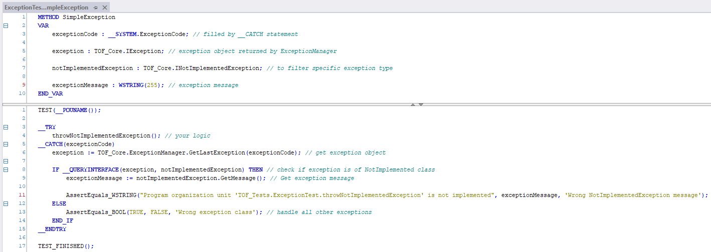
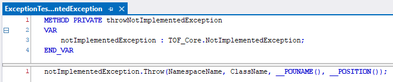
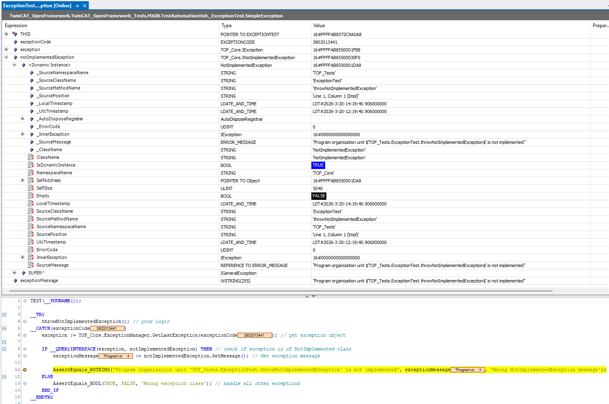

# `__TRY -> __CATCH -> __FINALLY` Usage Concept

## 1. General Description

Using `__TRY` -> `__CATCH` -> `__FINALLY` -> `__ENDTRY`, you can execute a block of code, handle exceptions if they occur, and run finalization logic that is always executed regardless of the outcome.

### Important Notes

1. Not all exceptions can be handled. For example, `__TRY->__CATCH` will **not** protect you from critical memory violations (such as invalid addressing or double memory releasing).

2. Inside `__CATCH`, you can retrieve an error code.
   This is simply a numeric value. Some error codes are predefined and described in the `__SYSTEM.ExceptionCode` enumeration.

3. You can create custom exceptions and raise them using the `Tc2_System.F_RaiseException` function.

4. The construct `__TRY -> __FINALLY -> __ENDTRY` **without** a `__CATCH` block is currently not supported.

5. At the time of writing (TwinCAT `3.1.4026.21`), the `__FINALLY` block is **not executed** if another exception occurs inside the `__CATCH` block.
   This behavior appears to be a bug and is expected to be fixed in future versions.

6. There are additional nuances that are currently not documented here, as they are expected to be resolved.
   Overall, the mechanism is stable enough for practical use.

---

## 2. Usage in OpenFramework

The standard mechanism only provides an error code (numeric), which is often insufficient.

This framework extends the default behavior to include additional contextual information:

### Extended Exception Data

Each exception can carry:

1. A textual error message
2. A numeric error code
3. Error location (namespace, class, method, line of code)
4. Timestamp (both local time and UTC)
5. Exception class (useful for filtering)

---

## 3. Core Concepts

To support this functionality, several internal components are implemented. Below is a simplified overview:

### 3.1 Exception Class

A dedicated class used to describe errors. Has many descendants for specific exception types.

* Contains a `Throw` method used to raise an exception

---

### 3.2 Exception Manager

Responsible for managing exception lifecycle:

* Stores the last thrown exception
* Provides access to it (e.g., inside a `__CATCH` block)
* Allows re-throwing the last exception

---

### 3.3 System DateTime Manager

* Updates system time variables
* Captures timestamps at the moment an exception occurs

---

### 3.4 Dynamic Memory Manager

* Exceptions are typically created as local variables
* To allow access outside their original scope, they are cloned
* Cloned instances are automatically released at the end of the cycle
* Prevents duplication of identical exceptions to optimize memory usage

---

## 4. How to Use

To use the exception mechanism, you need to implement two parts:

### 4.1 Exception Handling Point

Created a `__TRY -> __CATCH` block.



---

### 4.2 Exception Throwing Point

Your business logic where exceptions may be raised.



---

## 5. Execution behind the scenes

In addition to your code, the following internal calls are executed:

```pascal
Core.SystemDateTimeManager.Execute();

...

Core.ExceptionManager.Cleanup();
Core.DynamicMemoryManager.CleanupMemory();
```

---

## 6. Result



---

## 7. Example

```text
TwinCAT_OpenFramework_Tests -> ExceptionTest -> SimpleException
```
