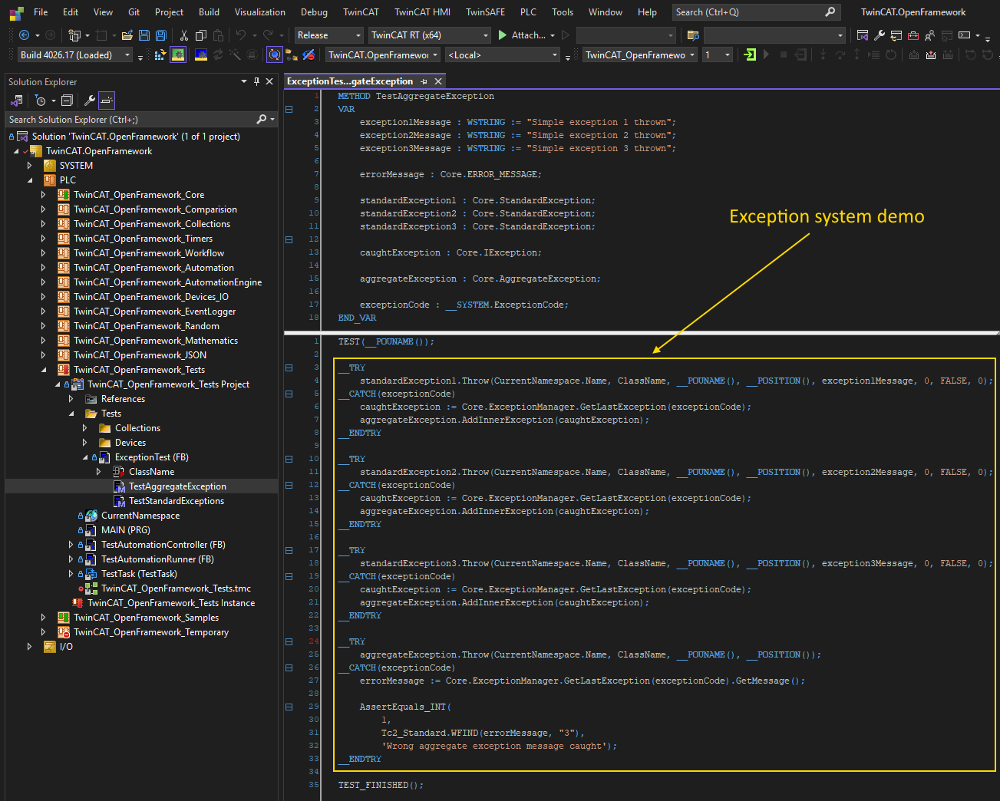

!!!!! This is PreAlpha version. Some conceps reimplemented at this time !!!!!

# TwinCAT Framework

Dear friends,  
I'm happy to present an **open-source object-oriented framework for TwinCAT**, featuring several unique capabilities.  
If you're interested — below you'll find a Q&A-style overview.

---

## ❓ What is it?

This is an **object-oriented framework** for developing PLC applications with **Beckhoff TwinCAT**.  
It's written in **Structured Text**, using modern OOP principles and the latest language features (TwinCAT 3.1.4026).

---

## 🔧 What's it good for right now?

It enables:

- Building applications using modern OOP concepts
- Making your code more modular, readable, and flexible
- Enhancing standard Beckhoff libraries with additional functionality

---

## 💡 What does the framework offer today?

- ✅ Core logic is based on an **exception-handling mechanism**. Many type of exceptions supported: Standard, NotSupported, NotImplemented, ArgumentNull, ArgumentoutofRange, ArgumentValueNotSupported, Aggregate, etc...
- ✅ Support for **dynamic collections**: ByteList, List, Dictionary, UniqueSet
- ✅ Utilities for working with **long strings**: StringHelper/WideStringHelper, StringBuilder/WideStringBuilder
- ✅ An **automation engine**: AutomationRunner manages 1..* AutomationUnits. Each Automationunit manages 0..* hierarchical devices
- 🔧 Many other components — either already ported or pending adaptation

---

## 📈 What are the future plans?

- 🧱 Add new possibilities and wrap more standard libraries in OOP-style interfaces
- 🧪 Broaden **unit test** coverage (TcUnit-based)
- 📚 Improve documentation and examples

---

## ✅ How reliable is it?

- Partially covered by **unit tests** using [TcUnit](https://github.com/tcunit/TcUnit)
- That said, the framework should be considered **experimental** at this stage
- Note: TwinCAT itself still has issues related to exception handling
- These issues aren't critical, and Beckhoff is aware and investigating solutions

---

## 🧱 Why do all classes inherit from `Object`?

Structured Text doesn't provide a universal base class for function blocks.  
To manage **dynamic memory deallocation**, we must know the actual type of the pointer.

- If the pointer refers to an FB, deallocation must occur via that FB pointer
- Otherwise, TwinCAT won't call the `FB_Exit` method

That's why we enforce inheritance from our own base class — `Object`.

---

## 🗂 Why this library structure?

Designing one involves hard tradeoffs: architectural purity vs. usability.  
The current structure is the result of many iterations and refactorings.  
If you have suggestions — I’m all ears.

---

## ⏱ What’s the development pace?

Development speed depends on:

1. Personal motivation  
2. Free time availability  
3. TwinCAT-related projects at my job  
4. Interest and feedback from other people

---

## 🤝 I want to help — how?

> “Two heads are better than one.”

Currently you can:

- Share your remarks and ideas
- Help to write tests
- Help to create documentation  
- Project visibility and outreach

If you're a fan of OOP, TwinCAT, or just want to help — get in touch!  
Also, if you're experienced in software architecture and have suggestions, I'd love to hear them.

---

## 🔍 How to get started?

1. Install the latest **TwinCAT XAE**  
2. Create a local folder (e.g. `D:\TwinCAT Framework`)  
3. Visit [my GitHub page](https://github.com/trofimich?tab=repositories)  
4. Clone [TwinCAT.OpenFramework repository](https://github.com/trofimich/TwinCAT.OpenFramework.git)
5. Open the solution in `TwinCAT.OpenFramework`

---

## 🧪 Are there examples?

Yes, there are two projects:  
- **`TwinCAT.OpenFramework.Tests`** — it contains unit tests and examples for specific classes.
- **`TwinCAT.OpenFramework.Samples`** — it contains demo application with simple visualization.

---

## 📄 License

This project is open-source and licensed under the **EUPL-1.1**.  
See [LICENSE](./LICENSE) for details.

