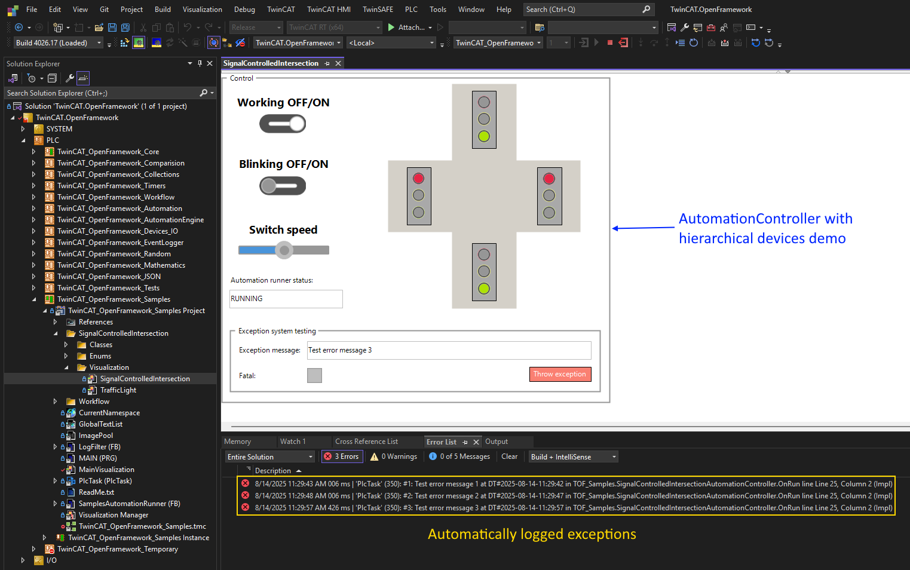

# TwinCAT Framework

This is **object-oriented framework** developed for **TwinCAT 3.1.4026+**, which provides a set of ready-to-use, scalable components for industrial automation.
It is based on an error-handling concept that is unique for Structured Text and resembles the approach used in general-purpose languages like C# or Java.

## ATTENTION
Do not update to TC 3.1.4026.19 if you use this framework because of new bug in exception handling mechanism.

## Key Features

- **Dynamic collections**  
  Work with an unknown number of elements at runtime.

- **String handling**  
  Convenient string concatenation, replacement, trimming, splitting for STRING and WSTRING types. Support for strings longer than 255 characters and more.

- **Logging system**  
  A convenient logging system with advanced filtering capabilities based on topics and support for custom logger implementations.

- **Workflow engine**  
  A powerful engine for executing complex scenarios that can be composed dynamically. Basic activities such as Sequence, IfThenElse, While, WaitForVariableValue, WaitAndPick, TryCatch, etc., are already supported. Custom activities can also be created to meet individual requirements.
  
- **JSON support**  
  Simplified serialization and deserialization of structures to and from JSON documents.

- **Basic automation engine**  
  A ready-to-use state machine: AutomationRunner supports three fundamental states: *Initializing*, *Running*, *Fault* and can handle multiple AutomationController instances with four fundamental states: *Initializing*, *Running*, *Stopping*, *Fault*

- **Simulation mode for automation engine and devices**  
  Run your logic in simulation mode without the need for real hardware.

- **Controllable devices**  
  Ready-made abstractions for interacting with the external world, such as terminals or communication channels.

- **Device hierarchy**  
  Intuitive modeling of complex devices composed of simpler sub-devices, which in turn may be composed of even simpler ones.

- **Predefined device implementations**  
  Includes digital and analog I/O; more standard device types such as axes are planned.

- **Advanced exception handling**  
  An enhanced error management system that makes diagnostics easier by providing not only the message, but also the place and time the problem occurred.

- **Automatic exception logging**  
  The automation engine automatically catches exceptions and logs them.

- **Modular architecture**  
  Use only the parts of the framework you need — no need to include everything.

- **Modern technologies and features**  
  Practical examples of object-oriented programming and the latest compiler features.

---

## 🚀 Visual comparision of some features:

  - Simple string concatenation is [here](Screenshots/FunctionalityComparision/SimpleConcat.png)
    
  - Long string concatenation is [here](Screenshots/FunctionalityComparision/ConcatLongString.png)
    
  - Dynamic collection is [here](Screenshots/FunctionalityComparision/List.png)
    
  - Logging is [here](Screenshots/FunctionalityComparision/Logging.png)
    
  - Error handling is [here](Screenshots/FunctionalityComparision/Exceptions.png)

---

## 🧪 Are there examples?

Yes, there are two projects:  
- **`TwinCAT.OpenFramework.Tests`** — it contains unit tests and examples for specific classes.
- **`TwinCAT.OpenFramework.Samples`** — it contains demo application with simple visualization. 

---

## 🔍 How to get started?

1. Install the latest **TwinCAT XAE**  
2. Clone [TwinCAT.OpenFramework repository](https://github.com/trofimich/TwinCAT.OpenFramework.git)
3. Open the solution in `TwinCAT.OpenFramework`

---

## 📈 What are the future plans?

- 🧱 Add new possibilities and wrap more standard libraries in OOP-style interfaces
- 🧪 Broaden **unit test** coverage (TcUnit-based)
- 📚 Improve documentation and examples

---

## 🧱 Why do all classes inherit from `Object`?

Structured Text doesn't provide a universal base class for function blocks.  
To manage **dynamic memory deallocation**, we must know the actual type of the pointer.

- If the pointer refers to an FB, deallocation must occur via that FB pointer
- Otherwise, TwinCAT won't call the `FB_Exit` method

That's why we enforce inheritance from our own base class — `Object`.

---

## 🗂 Why this library structure?

Designing one involves hard tradeoffs: architectural purity vs. usability.  
The current structure is the result of many iterations and refactorings.  
If you have suggestions — I’m all ears.

---

## ⏱ What’s the development pace?

Development speed depends on:

1. Personal motivation  
2. Free time availability  
3. TwinCAT-related projects at my job  
4. Interest and feedback from other people

---

## 🤝 I want to help — how?

Currently you can:

- Share your remarks and ideas
- Help to write tests
- Help to create documentation  
- Project visibility and outreach

If you're a fan of OOP, TwinCAT, or just want to help — get in touch!  
Also, if you're experienced in software architecture and have suggestions, I'd love to hear them.

---

## ⚠️ Known Issues

- Beckhoff currently use compiler from CoDeSys and this compiler has some issues:
  - incorrect behavior related to methods with optional parameters in some cases
  - incorrect memory deallocation in __TRY / __CATCH block in some cases

These issues aren't critical, and Beckhoff is aware and investigating solutions

---

## 📄 License

This project is open-source and licensed under the **LGPLv3** license, which allows:

**Use in proprietary software:** You can use an LGPLv3-licensed library in closed-source/commercial applications.

**Dynamic linking:** You may dynamically link to the library without releasing your own source code.

**Static linking:** Allowed if you provide a way for users to replace or relink the library (e.g. with object files).

**Modifications to the library:** You must release any changes to the library itself under LGPLv3.

**Distribution:** You can distribute the library freely, as long as you include the license and make the source code available.

See [LICENSE](./LICENSE) for details.

---

## 🖼️ Screenshots 

