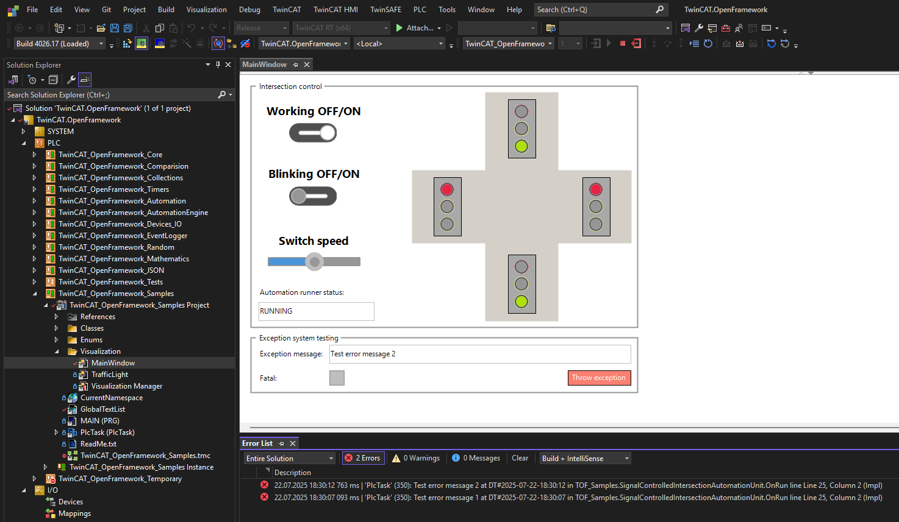
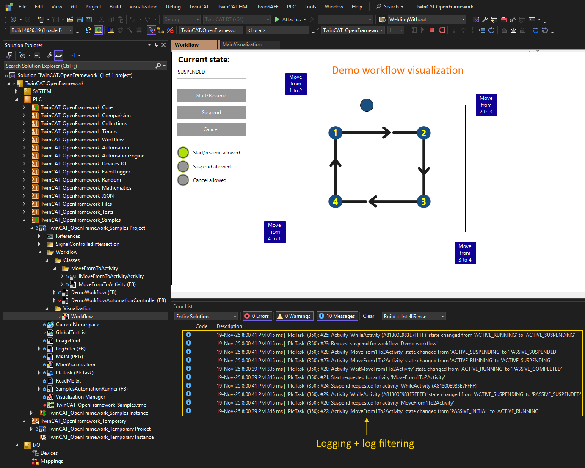
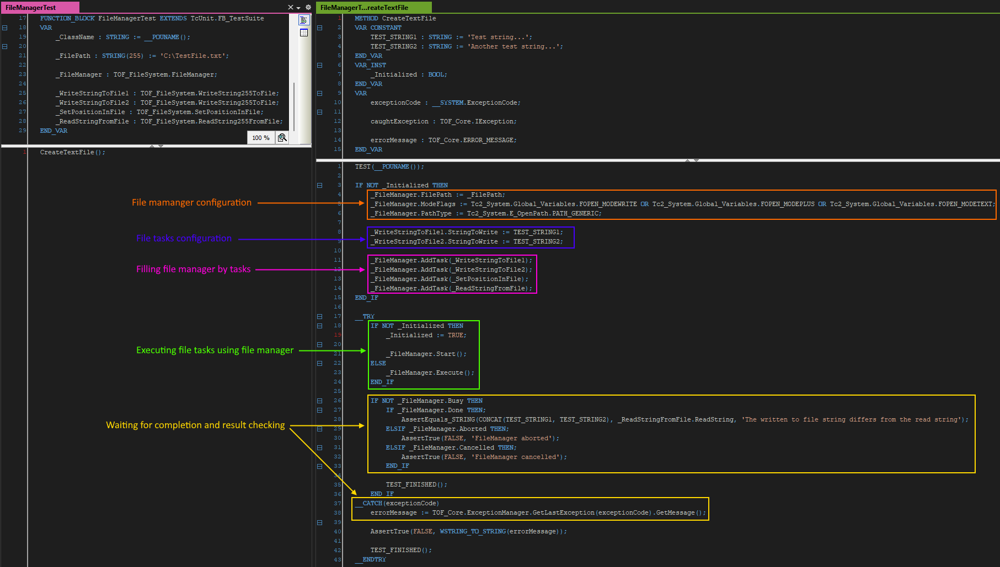
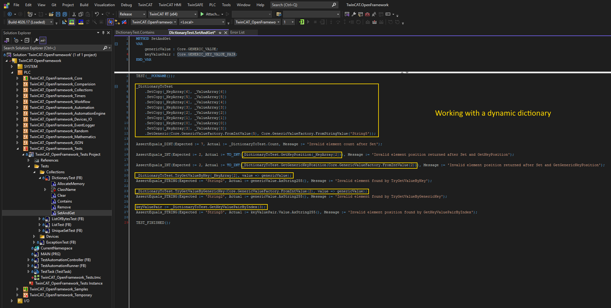
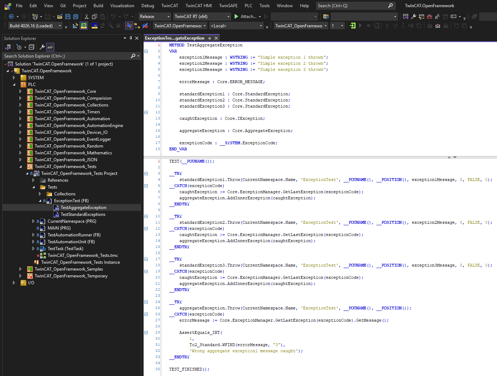
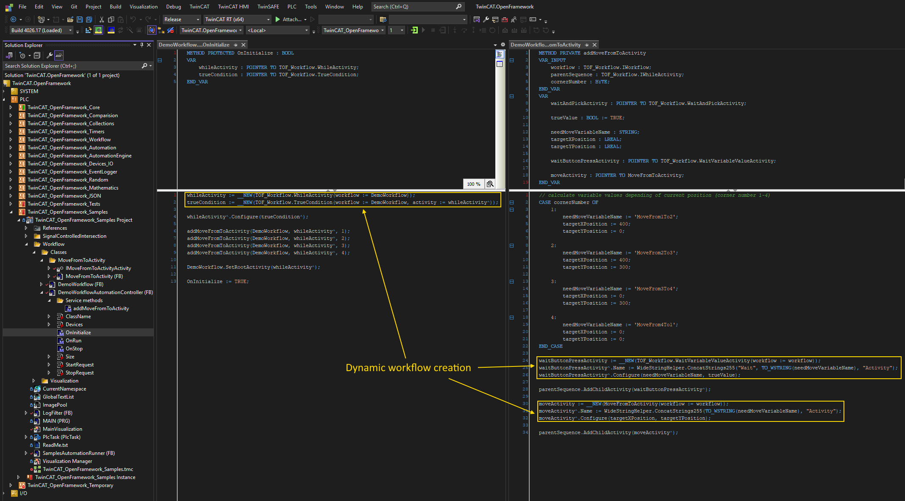

# TwinCAT.OpenFramework: Technical Capabilities

This is an **object-oriented framework** developed for **TwinCAT 3.1.4026+**, providing a set of ready-to-use, scalable components for industrial automation. 

It bridges the gap between traditional PLC programming and modern software engineering, bringing IT-standard approaches (like those in C# or Java) directly into Structured Text.

---

## 🛠️ Core Capabilities

To make large-scale application development manageable, the framework's features are divided into three main pillars:

### 1. Enterprise-Grade Automation Architecture
*   **Basic Automation Engine:** A ready-to-use state machine. `AutomationRunner` handles top-level execution states (Initializing, Running, Failed), while managing multiple `AutomationComponent` instances with their own lifecycles.
*   **Controllable Devices & Hierarchy:** Intuitive modeling of complex machines composed of nested sub-devices. Ready-made abstractions for interacting with the external world (e.g., digital and analog I/O, axes).
*   **I/O Separation:** Device classes contain *only* business logic. Physical mapping is done at the terminal model level, meaning hardware changes don't require rewriting device logic.
*   **Workflow Engine:** A powerful engine for composing complex, dynamic execution scenarios (Sequence, IfThenElse, While, WaitAndPick, TryCatch, etc.). Custom activities can be easily integrated.

### 2. Modern IT Practices in PLC
*   **Advanced Exception Handling:** An error management system unique to Structured Text. It provides not just the error code, but the exact context, place, and time the problem occurred, drastically reducing troubleshooting time.
*   **Dynamic and Generic Static Collections:** Break free from rigid arrays. Support for `List`, `ByteList`, `Dictionary`, `UniqueDataSet`, and `Queue` — working with an unknown number of elements at runtime or defining static sizes at instantiation.
*   **Tasks & Queues:** Abstractions for asynchronous operations. Tasks can be aborted, cancelled, or fail with exceptions. The Task Queue allows composing multiple tasks into continuous sequences or background workers.
*   **JSON Support:** Native, simplified serialization and deserialization of PLC structures to and from JSON documents, crucial for IT/MES/ERP integration.

### 3. Developer Productivity Tools
*   **Advanced String Handling:** Convenient manipulation (concatenation, trimming, splitting, joining) for `STRING` and `WSTRING`, including support for strings larger than 255 characters.
*   **Modular Logging System:** Topic-based filtering with support for custom logger implementations (e.g., simple file logging is provided out of the box). Exception logging is handled automatically by the engine.
*   **File System Abstraction:** File operations are represented as safe, sequence-based tasks. Resource management (opening/closing files) is handled automatically behind the scenes.

---

## 🚀 Visual Feature Comparison

Seeing is believing. Compare traditional ST approaches with the framework:
*   [Simple string concatenation](Screenshots/FunctionalityComparision/SimpleConcat.png)
*   [Long string concatenation](Screenshots/FunctionalityComparision/ConcatLongString.png)
*   [Dynamic collections](Screenshots/FunctionalityComparision/List.png)
*   [Structured Logging](Screenshots/FunctionalityComparision/Logging.png)
*   [Exception Handling](Screenshots/FunctionalityComparision/Exceptions.png)

---

## 🧪 Examples & Getting Started

You don't have to start from scratch. The repository includes:
1.  **`TwinCAT.OpenFramework.Tests`** — Unit tests and usage examples for specific classes.
2.  **`TwinCAT.OpenFramework.Samples`** — A complete demo application with visualization (e.g., [Signal-Controlled Intersection Demo](Guides/SignalControlledIntersectionDemo.md)).

**To try it out:**
1. Install the latest **TwinCAT XAE**.
2. Clone the [TwinCAT.OpenFramework repository](https://github.com/trofimich/TwinCAT.OpenFramework.git).
3. Open the solution and run the samples.

---

## 📈 Roadmap & Community

TwinCAT.OpenFramework is an actively evolving open-source project. Future development focuses on:
*   Wrapping more standard libraries in OOP-style interfaces.
*   Broadening unit test coverage (TcUnit-based).
*   Expanding enterprise-level documentation.

**Want to contribute?** 
Whether you want to share architectural ideas, request features, or contribute code, feedback is highly appreciated. Open an issue or reach out via GitHub.

---

## 💡 Technical Notes

**Why do all classes inherit from `Object`?**
Structured Text doesn't provide a universal base class for function blocks. To manage **dynamic memory deallocation** safely and ensure TwinCAT calls the `FB_Exit` method, we enforce inheritance from a unified base class (`Object`). This guarantees memory safety across dynamic collections.

---

## 🖼️ Screenshots 

*(Visualizations of Workflow Engine, Collections, and File Manager)*

