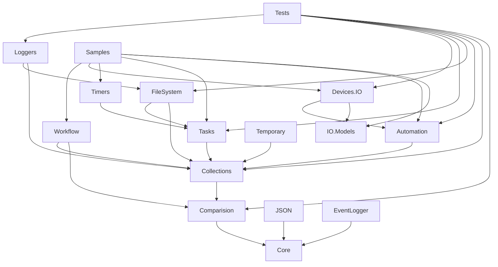
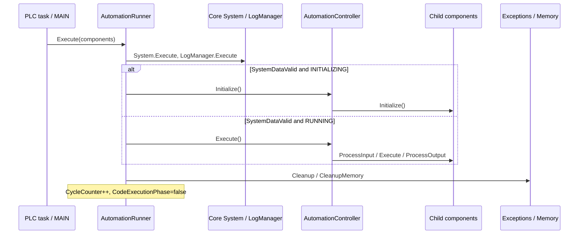

# Карта архітектури

Оновлення після правок власника: runner initialization error paths тепер використовують `JMP FINAL_ACTIONS` і не пропускають нормальний епілог. FileContentManager володіє file resource на рівні черги, а FileContentTask отримує borrowed handle; це слід відрізняти від StandardTaskQueue із child, що володіє власним resource. Власник підтвердив контракт best-effort close: failure журналюється як ERROR, framework завершує керування ресурсом, а результат основної файлової операції не змінюється через невдалий close. Див. [повторний review](recheck-2026-10-02.md). Решта карти та числовий inventory описують первинний baseline.

Дата та baseline наведені в [README](README.md). Висновки стосуються поточних вихідних файлів; відповідність встановлених `.library` цьому commit не перевірена.

## Організація репозиторію та solution

`README.md` описує три концептуальні шари: execution, programming model і foundation. `TECHNICAL_DESCRIPTION.md` задає TwinCAT 3.1.4026+; усі 16 `.plcproj` мають `ProgramVersion=3.1.4026.27`, таку ж версію зберігає `.tsproj`. Концепти пояснюють generics, колекції, винятки та automation; guide проводить через приклад перехрестя.

`Sources/TwinCAT.OpenFramework.sln` містить один верхньорівневий TwinCAT system project. Його `.tsproj` містить усі 16 PLC-проєктів. У `.sln` є конфігурації Debug/Release для x86, x64 і кількох ARM/TwinCAT OS варіантів; наявність конфігурації не підтверджує працездатність на відповідній платформі.

13 основних бібліотек мають версію `1.0.10.0`; `Tests` і `Samples` — `1.0.7.0`; `Temporary` — `0.0.0.1`. В `.tsproj` лише `Tests` (AMS 865) і `Samples` (AMS 866) не мають `Disabled=true`. Цей атрибут сам по собі не використовується тут як доказ того, що бібліотеку неможливо компілювати. `Temporary` описаний як legacy-код для подальшої міграції.

## Бібліотеки та прямі внутрішні залежності

У колонці залежностей наведено саме задекларовані library placeholders, без транзитивних залежностей. Повні назви, namespaces, зовнішні бібліотеки та resolutions є в [inventory.json](inventory.json). Кількість `Compile` включає всі типи включених об'єктів, а не тільки POU.

| Проєкт | Namespace | Compile | Прямі внутрішні залежності | Роль |
|---|---|---:|---|---|
| Core | TOF_Core | 168 | — | Object, базові контракти, generics, пам'ять, винятки, strings, system, logging |
| IO.Models | TOF_IOModels | 45 | — | Структури каналів і терміналів із прив'язкою `%I*`/`%Q*` |
| Comparision | TOF_Comparision | 29 | Core | Comparers/predicates для ANY та generic-даних |
| Collections | TOF_Collections | 24 | Core, Comparision | List, ByteList, Dictionary, UniqueDataSet, Queue та enumerators |
| Tasks | TOF_Tasks | 14 | Core, Collections | Кооперативні задачі, життєвий цикл ресурсів, черги |
| Timers | TOF_Timers | 5 | Core, Tasks | Timer як Task поверх TON |
| Automation | TOF_Automation | 41 | Core, Collections | Runner, дерево branch/leaf-компонентів, policies, plugins/HMI |
| Devices.IO | TOF_Devices_IO | 25 | Core, Automation, IO.Models | Digital/Analog Input/Output, конвертори значень |
| Workflow | TOF_Workflow | 45 | Core, Collections, Comparision | Дерево activities, variables, sequence/conditional/loop/wait/try-catch |
| FileSystem | TOF_FileSystem | 27 | Core, Collections, Tasks | Файлові й directory-задачі, file handle manager |
| Loggers | TOF_Loggers | 6 | Core, Collections, FileSystem | File logger та Beckhoff EventLogger adapter |
| EventLogger | TOF_EventLogger | 3 | Core | Окрема абстракція EventLoggerMessage, не тотожна Loggers |
| JSON | TOF_JSON | 5 | Core | Серіалізація структур через Tc3_JsonXml |
| Tests | TOF_Tests | 28 | Core, Comparision, Collections, Tasks, Automation, Devices.IO, FileSystem, Loggers | TcUnit suites та runner |
| Samples | TOF_Samples | 39 | Core, Tasks, Timers, Automation, Devices.IO, IO.Models, Workflow | Intersection і workflow demo з візуалізаціями |
| Temporary | не заданий | 78 | Core, Collections | Старі communication/database/state-machine abstractions |

Стрілка означає «використовує». Для читабельності на діаграмі пропущено повторювані прямі ребра до Core; таблиця вище повна щодо внутрішніх залежностей.

Зовнішні залежності: `Tc2_System`, `Tc2_Standard`, `Tc2_Utilities`, `Tc3_Module`, `Tc3_JsonXml`, `Tc3_EventLogger`, `BreakpointLogging`; для Tests — `TcUnit 1.3.1`; для Samples — бібліотеки visualization. Core вже залежить від JsonXml, тому він ширший за мінімальний runtime-independent фундамент. Внутрішні посилання є placeholders, а не `ProjectReference`: відкриття всієї solution не доводить, що споживач використовує щойно змінену бібліотеку з цієї solution.

## Основні контракти

| Контракт | Призначення та важливий інваріант |
|---|---|
| `IObject` / `Object` | QueryInterface, ClassName, NamespaceName, SelfAddress, SelfSize, IsDynamicInstance. Основа видалення через Object pointer; метадані нащадків мають бути коректними |
| `IExecutable` | Спільний контракт циклічного Execute; сам по собі не визначає scheduler |
| `IEnumerable` / `IEnumerator` | CreateEnumerator, MoveNext, Reset, Current як reference до GENERIC_VALUE; lifetime результатів потребує окремої перевірки |
| `IGenericValueValidator`, `IComparer`, `IPredicate` | Валідація та порівняння даних без статичної конкретизації типу |
| `ILogger` / `LogManager` | TryLogMessage/Error/Exception, циклічний Execute; facade, filter і default logger у Core |
| `IAutomationComponent` | Initialize, Execute, Enable/Disable, Stop/Reset, error/state; INITIALIZING → WORKING, STOPPED, INVALID |
| `IParentAutomationComponent` / `IChildAutomationComponent` | Дерево, ChildCount, indexed access, Parent; broadcast/bubble events і permissions |
| `ITask` / `IResourceManager` | Start/Execute/Cancel/Reset, Original/FinalStopReason, acquire/release resource |
| `IWorkflow` / `IActivity` | RootActivity, variable containers, start/cancel/suspend, active/passive states |

## Основний цикл виконання

Докази: [Samples MAIN](../../Sources/TwinCAT.OpenFramework.Samples/MAIN.TcPOU), [Tests MAIN](../../Sources/TwinCAT.OpenFramework.Tests/MAIN.TcPOU), [AutomationRunner.Execute](../../Sources/TwinCAT.OpenFramework.Automation/AutomationRunner/AutomationRunner.TcPOU).

1. PLC task викликає `MAIN`. Обидва `.TcTTO` задають 10000 мкс (10 мс); пріоритет Tests — 1, Samples — 20.
2. `MAIN` має статичні controller/runner instances і масив інтерфейсів компонентів. Samples передає IntersectionController і DemoWorkflowController; Tests передає TestAutomationController.
3. Runner встановлює `GlobalState.CodeExecutionPhase`, викликає `TOF_Core.System.Execute()` та `LogManager.Execute()`.
4. Виконання компонентів дозволяється лише після `System.SystemDataValid`. System оновлює AMS/timezone/local/UTC time через системні FB.
5. У INITIALIZING runner циклічно викликає Initialize компонентів і дивиться на OperationalState. У RUNNING циклічно викликає Execute.
6. У звичайному завершенні викликає `ExceptionManager.Cleanup()` та `DynamicMemoryManager.CleanupMemory()`, збільшує CycleCounter і скидає CodeExecutionPhase. Не всі ранні виходи/винятки захищають цей епілог; це предмет A03.

## Компоненти, IO та policies

`AutomationComponent` зберігає Name/Enabled/OperationalState/Error/ExceptionHandlingPolicy. `BranchAutomationComponent` задає загальний алгоритм для children; `AutomationController<N>` є кореневою гілкою з plugins, `CompositeAutomationComponent<N>` також має Parent. Leaves поділені на input/output/input-output. Назви в документації `CompositeDevice`/`InputDevice` не збігаються з поточними базовими класами.

У controller `OnBeforeExecute` запускає plugins і обхід input children. Далі `doWork` викликає `OnBeforeChildrenWorking`, children.Execute, `OnAfterChildrenWorking`. `OnAfterExecute` обробляє outputs і plugins. Leaf.Execute сам також обробляє input/output відповідно до підтриманих інтерфейсів. Отже, callbacks IO можуть бути викликані через кілька шляхів обходу; їх кратність та порядок для вкладених composite слід перевірити, перш ніж вважати input edges однозначними.

Статична кількість children задана `VAR_GENERIC CONSTANT`; references до children і Parent ін'єктуються через FB_init/властивості. `DigitalInput` читає прив'язаний BOOL reference; `DigitalOutput` записує logical current value в raw BOOL. IO.Models задає фізичні канали окремими DUT, наприклад `EL3001.Ch1` із Status/Value. Це дає незалежний рівень mapping, хоча коректність layout і polarity ще не перевірена.

Помилки під час initialization переводять компонент у INVALID. У working policy визначає ignore / error-and-continue / error-and-stop; critical child errors обробляються окремою policy. Error-and-stop викликає Stop, а non-critical error може автоматично очищатися з викликом OnRecover на наступному виконанні. Enable/Disable та Reset — окремі операції; їх точні інваріанти входять до A07.

## GENERIC_VALUE та пам'ять

`GENERIC_VALUE` містить TypeClass, Address, Size та IsMemoryOwner. `Reset` лише очищає метадані; `Release` звільняє пам'ять власника й скидає значення. Factory розрізняє клонування з ownership, borrowing та adoption оригінального reference. Для OBJECT спочатку пробує ICloneable; fallback копіює байти.

`List<N>` має статичний масив при N>0 та heap-buffer при N=0. Розширення копіює байти GENERIC_VALUE; RemoveAt робить Release, MEMMOVE і Reset останнього slot. Це вимагає дисципліни передачі ownership: копія descriptor не повинна випадково створювати двох власників одного allocation. Для винятків є окремий lifetime: `Exception` містить `AutoDisposeRegistrar(THIS^)`, а DynamicMemoryManager очищає зареєстровані динамічні instances наприкінці циклу. Сам `Object.FB_init` усі динамічні об'єкти автоматично не реєструє.

`ExceptionManager.Throw` зберігає dynamic exception або клонує static/local exception, після чого викликає F_RaiseException. `GetLastException` відрізняє framework exception від системного за exception code; є workaround для старого build. Manager має одне поле `_Exception`, а memory manager — один registry і cycle counter. Підтримку конкурентних PLC tasks не слід припускати: `TO_DO.txt` прямо згадує її як майбутню роботу. За однакових CycleCount різних tasks ізоляція очищення також потребує аналізу.

## Tasks, файли та logging

Tasks — кооперативні state machines, а не окремі OS/PLC threads. Start може одразу виконати крок. Execute просуває READY/RUNNING/STOPPED та acquire → processing → release. Cancel може лише перевести до RESOURCE_RELEASING; подальші Execute потрібні для завершення. OriginalStopReason і FinalStopReason розділяють результат роботи та завершення/cleanup.

TaskQueue зберігає borrowed tasks у List, запускає першу і циклічно викликає її Execute. FileContentManager успадковує TaskQueue та має FileHandleResourceManager як ResourceManager. File handle відкривається/закривається системними FB; file content tasks працюють із handle resource. SimpleTextFileLogger буферизує повідомлення, формує byte buffer, ставить WriteBytesToFile у чергу й ротує файли. Наявність API resource management не доводить завершення cleanup у всіх cancellation/error paths.

## Workflow та JSON

Workflow — окремий механізм виконання, без прямої залежності від Tasks. Він володіє registry динамічних children й dictionary variables. Activity має ParentActivity/Workflow і ACTIVE_RUNNING/CANCELLING/SUSPENDING та PASSIVE states. Start/Cancel можуть одразу викликати OnRunning/OnStopping. SequenceActivity виконує поточну activity і переходить до наступної; callbacks, rethrow, restart/resume та registry ownership потребують A08.

Sample DemoWorkflowController викликає RequestStart один раз, потім Execute кожного циклу. DemoWorkflow описує шість variables, обробляє HMI requests через callbacks. У Workflow.Execute назви `OnRootActivityExecuted`/`OnRootActivityExecuting` викликаються у порядку, який слід звірити з бажаним контрактом; тут це не оголошено багом.

AutomaticJsonSerializer використовує Tc3_JsonXml runtime type information: ANY/AnyType, GetDatatypeNameByAddress, AddJsonValueFromSymbol і SetSymbolFromJson. `JSON/ReadMe.txt` прямо обмежує source/target structure статичною пам'яттю. Перевірка цього контракту та json buffer size — частина A11.

## Невирішені архітектурні питання

- Чи Tests і Samples повинні одночасно виконуватися на одному runtime? Це різні PLC applications; наявність обох у system project сама по собі не доводить спільну пам'ять managers.
- Який контракт допустимих allocations під час real-time циклу та обмеження часу/пам'яті для динамічних колекцій?
- Яка очікувана кратність ProcessInput/ProcessOutput для одного leaf за цикл?
- Чи допускається зберігання IException/enumerator поза поточним циклом і хто володіє nested exceptions?
- Який порядок побудови та встановлення бібліотек гарантує використання поточних sources?

Відповіді варто зафіксувати в документації під час відповідних задач аудиту, не підмінюючи поведінку коду припущеннями.

## ITask evolution — 2026-10-02

Після первинного аудиту внесено T00–T10 у межах доручення власника. Це не повний
аудит фреймворка й не підтверджена runtime поведінка. Актуальний контракт:
[itask-contract.md](itask-contract.md); [журнал](itask-execution-journal.md).

Task використовує один внутрішній StopRequested для всіх причин: запит →
OnStopping/CanStop → власний release → STOPPED. Queue скасовує й просуває current
child до завершення перед parent release. Перша original причина зберігається;
cleanup failure окремо впливає на final; queue читає final результат child.
ITask status повертає interface live views; ресурсні phases винесено в optional
ITaskResourceDiagnostics. Core додає optional IResourceCleanupStatus для pending
операцій manager. File manager завершує pending open перед close; best-effort
close із error log збережено. Нового public state не введено.

Tests має TaskLifecycleTest із 22 TcUnit методами та прямою залежністю на Timers.
Відокремлений тимчасовий fixture project прибрано із Sources; у solution, як і
раніше, 16 PLC-проєктів. Збірка, runtime та реальні file/logger інтеграції після
цих змін не виконані. [Ручна перевірка й міграція](itask-manual-validation.md).

## Уточнення Task stop reasons — 2026-10-04

Після поступових змін і погодження власника OriginalStopReason зберігає причину
початку завершення та original message під час resource release. Throwing release
встановлює тільки FinalStopReason=FAILURE із повідомленням exception. Тому
WORK_DONE/FAILURE є допустимою парою: основна робота виконана, cleanup завершився
з помилкою. Best-effort file close, оброблений самим manager, не змінює final.
TaskQueue ще читає Original дитини; перехід на оцінку Final потребує наступного
окремого погодженого кроку. Деталі поточного коду: task-review-after-rollback.md.
## Контракт release exception і STOPPED — 2026-10-04

Підтверджено власником: normal ReleaseResource із ResourceAcquired=TRUE потребує
наступного Execute; FALSE завершує спробу cleanup manager. Release exception
є terminal для поточного життєвого циклу Task: STOPPED/Final=FAILURE без
автоматичного retry. STOPPED не гарантує фізичного звільнення ресурсу.
Recoverable errors і recovery ресурсу після terminal exception визначає manager.
Best-effort close може журналювати помилку та завершувати cleanup без exception.
## Публічний контракт ITask — уточнення власника 2026-10-04

ResourceManager навмисно є частиною ITask: одиниця роботи може потребувати
отримання та звільнення ресурсу, зокрема файла або з'єднання. Його залишено
в інтерфейсі; 0 означає відсутність керованого ресурсу. Під час RUNNING ресурсним
життєвим циклом керує задача; зовнішній код не викликає acquire/release напряму.
RunningSubstate залишається діагностикою, чинною в RUNNING.

Один відповідальний owner просуває Execute до STOPPED, зокрема після Cancel.
State і reasons є live views для читання; для збереження результату перед Reset
потрібно копіювати значення та повідомлення. StateChanged залежить від викликів
методів, а не гарантовано від одного PLC cycle. Коментарі ITask описують зовнішній
контракт без згадок внутрішніх callbacks базового Task.

Змінено лише коментарі ITask; методи, властивості, їхні типи та IDs збережено.
XML і diff перевірено; ST compilation/runtime не виконувалися.
### TaskQueue Reset — остаточне уточнення власника 2026-10-04

Власник змінив рішення: Reset у STOPPED очищує чергу та current, не викликаючи
Reset дочірніх задач і не видаляючи їхні об'єкти. Черга зберігає borrowed references;
підготовкою та повторним додаванням children керує caller. Попереднє рішення
зберігати залишок більше не діє. У READY базовий Reset залишається no-op:
для очищення ще не запущеної черги використовується ClearWaitingTasks.

### Timer: момент запуску і Restart — 2026-10-05

За погодженням власника додатний interval TON починається синхронно в
Timer.OnBeforeStart. Execute виявляє завершення; затримка до першого Execute
не переносить початок відліку. Restart може синхронно зупинити звичайний Timer
через Cancel/Execute, скинути і запустити його. Для нащадка з незавершеним
cleanup повертає FALSE без відкладеного restart. SetIntervalAndRestart змінює
interval лише після успішної підготовки. Періодичний дрейф не компенсується.
Деталі, обмеження й невиконані runtime checks: task-review-after-rollback.md.

### FileContentManager cancellation — 2026-10-05

Сім file-content children через OnCancelling очікують NOT bBusy уже поданого
файлового запиту. FileContentManager.OnCancelling спочатку виконує inherited
queue wait, потім FinishPendingAcquire ресурсного менеджера. Pending open
просувається без нового запуску; пізній успішний handle зберігається для close.
Тільки після цих очікувань починається звичайний release. Це обробка відповіді
ADS, а не гарантія фізичного abort на target після timeout. Runtime не перевірено.

### FileHandleResource target — 2026-10-05

FileHandleResource надає AmsNetId разом із FileHandle. Конкретні file-content
операції копіюють обидва значення перед першим запитом; окремо заданий child
AmsNetId не визначає target прив'язаного handle. Адресу manager налаштовують
до Start і зберігають до STOPPED. Remote runtime не перевірений.

### Object memory ownership — уточнення власника 2026-10-06

Object сам не реєструє всі dynamic instances. AutoDisposeRegistrar є opt-in:
після успішної реєстрації DynamicMemoryManager має виключний ownership object
до cleanup. Інші references є borrowed; ручне видалення та передача ownership
іншому owner заборонені. Cleanup завершує lifetime borrowed references.
FB_exit нащадків Object і disposal logger/filter мають завершуватися без
exceptions. Memory.TryRelease… не перехоплює exceptions: Try означає відмову
для null/non-dynamic адреси. Обидва правила підтверджені власником; коментарі
додано без зміни логіки. Журнал: [core-memory-journal.md](core-memory-journal.md).
ST compilation/runtime цього кроку не виконано.

Власник також визначив allocation failure реєстру критичною помилкою,
після якої контролер має зупинитися. Погоджено й реалізовано _AllocationFailed
та RaiseIfAllocationFailed у DynamicMemoryManager: нульовий allocation піднімає
RTSEXCPT_OUT_OF_MEMORY без framework exception object, старий buffer/capacity
не змінюються при невдалому growth. Flag зберігається до переініціалізації
PLC application. AutomationRunner перевіряє його у FINAL_ACTIONS до cleanup,
поза callback handlers. Caller не повинен поглинати fatal exception самого
Runner.Execute; у поточних MAIN цього немає. Без runner така boundary-перевірка
є обов'язком application. XML/scope/IDs перевірено; ST/runtime не виконано.

Власник уточнив задум Objects.IsMemoryValid як перевірку, чи об'єкт іще живий.
Поточний query і наведена memory-area heuristic такої гарантії не дають:
повторне використання адреси не зберігає identity попереднього instance.
Borrowed references чинні лише в межах lifetime, визначеного owner.
За погодженням власника IsMemoryValid видалено; див. core-memory-journal.md, C05.

Cleanup callbacks (FB_exit і disposal logger/filter) за підтвердженим власником
контрактом не реєструють нові auto-disposed objects і не викликають cleanup
повторно. Звільняти власні ресурси дозволено. Це передумова без runtime guard;
DynamicMemoryManager не підтримує reentrant mutation реєстру. Журнал C07.

ExceptionManager.ReThrowLastException за уточненням власника 2026-10-06 має
повторно піднімати поточний caught exception, включно із системним. Поточна
реалізація через global slots цього не гарантувала. Після погодження метод
отримує caught code і optional saved payload; усі 14 callers оновлено.
Scope та nested-handler обмеження: core-exceptions-review.md, E03.

SystemException тепер має AutoDisposeRegistrar, як і Exception: його dynamic
instances належать DynamicMemoryManager до cleanup. Clone копіює code/catch point;
за наступним підтвердженням власника timestamps фіксуються у Configure під час
GetLastException і копіюються Clone без змін (раніше getters читали live clock).
Clear скидає timestamps до MIN_VALUE. Відмова allocation у Clone використовує
спільний fatal latch DMM через INTERNAL RaiseAllocationFailure; власник підтвердив
цю terminal policy. Registry guard використовує той самий helper. ST/runtime
не перевірено. Контракт і compatibility: core-exceptions-review.md, журнал.

AggregateException за погодженим контрактом містить максимум 255 flattened entries.
Self-add і cyclic inner graphs заборонені передумовою без runtime graph check.
Перевищення capacity викликає existing fatal OUT_OF_MEMORY latch до зміни
масиву для поточного entry; попередні additions flattening не відкочуються.
Public count лишається UINT. CopyFields вимагає empty destination, відмінний
від source. Empty semantics і статус без перевірок: core-exception-payload-review.md.

2026-10-06: власник погодив пропагувати native помилки як SystemException через
framework Throw. ReThrowLastException більше не гарантує native код у наступному
сирому CATCH: причину, перший catch point і час зберігає payload. Статичний
SystemException клонується при передачі; dynamic payload зберігає identity.
Workflow робить snapshot shared system instance до callbacks. Fatal allocation
latch перевіряється до клонування і продовжує окремий terminal шлях без heap
exception. Втрата коду вже на первинному F_RaiseException у runtime 3.1.4026.27
залишається обмеженням. Деталі й невиконані перевірки: core-exceptions-review.md.

2026-10-06: власник уточнив INamed.Name та IErrorProvider.Error: borrowed
references лише для читання без копіювання, зовнішня зміна не дозволена.
REFERENCE TO не забезпечує цей read-only контракт типово; правило потребує
документування біля декларацій після погодження змін. Clone за задумом власника
лише створює копію, сам не керує ownership. Це не надає generic consumer
автоматичного права видаляти auto-disposed exception clone. Огляд 13 interfaces
і відкриті питання: core-interfaces-review.md.
